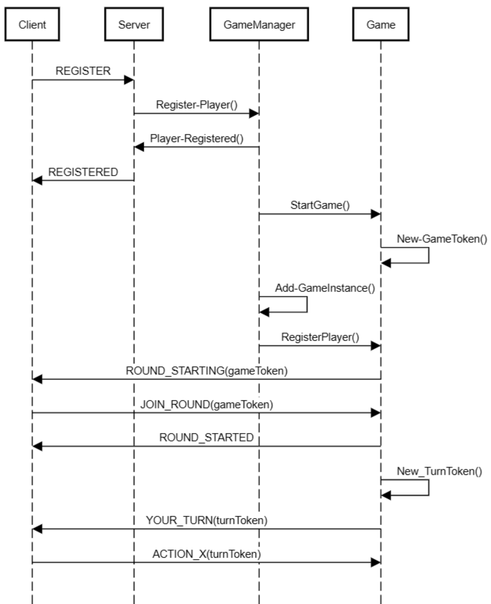

# Server protocol

## Preliminaries
1. Client and server communicate via UDP (using UTF-8 encoded strings).
1. Server opens with a communicated port.
1. Clients register themselves as player and are notified for each game.
1. Clients have to respond within in a narrow time frame (250 ms).
1. Alternatively a client could register as a spectator. Spectators are not able to actively participate in the game. Yet they will receive all messages every other client would receive.

## Registration
1. Client->Server: REGISTER;name 
1. Server->Client: REGISTERED or REJECTED
 
The server accepts the registration (server->client: REGISTERED) if the name is valid and either
1. a new client registers for the first time, or
1. an existing client re-registers from the same client IP as before (but possibly with a different port; see below).

In all other cases, the server rejects the registration request (Server->Client: REJECTED).

Valid names need to satisfy the following criteria:
1. no whitespace
1. no colons, semicolons, or commas
1. up to 20 characters

After a successful registration, the server will send messages to the client using the IP and the port from which the registration message was sent.

## Game start
1. Server->Clients: GAME_STARTING;token 
1. Client->Server: JOIN_SPECTATOR;name;token
1. Client->Server: JOIN_GAME;name;token 
1. Client->Server: JOIN_ROUND;name;token (only for single server mode)

If at least one player participates:
1. Server->Clients: GAME_STARTED;players;token

The server shuffles the participating players at the beginning of the game. The order of the list corresponds to the order in which each round is played. The value is a comma separated list of all participating players.

Reasons for cancellations:
1. Server->Clients: GAME_CANCELED;NO_PLAYERS (a new game is started immediately)
Games with just one player are canceled right after their start (GAME_CANCELED;ONLY_ONE_PLAYER).

## Turn actions
In adherence to the previously announced order:
1. Server->Client: YOUR_TURN;token 
1. Client->Server: command;token (where command has to be either ROLL or SEE)

On SEE:
1. Server checks if last announced dice are valid and determines the losing players
1. Server->Clients: PLAYER_WANTS_TO_SEE;name;token
1. Server->Clients: ACTUAL_DICE;dice;token
1. Server->Clients: PLAYER_LOST;name;reason;token

On ROLL:
1. Server->Clients: PLAYER_ROLLS;name;token 
1. Server->Client: ROLLED;dice;token 
1. Client->Server: ANNOUNCE;dice;token 
1. Server->Clients: ANNOUNCED;name;dice;token 

Per turn there is a second ROLL allowed, in this case the server will not send the dice back to the player, but the player still has to announce something.

When the server detects Mia with the first roll, the game ends, and the current player wins.
1. Server->Clients: PLAYER_LOST;names;reason;token (where names is a comma separated list)

Whenever a players does not respond in time or does something wrong. The player will be excluded from the game.
1. Server->Clients: PLAYER_LOST;name;reason;token 

At the end of each game:
1. Server->Clients: SCORE;playerpoints;token (where playerpoints is a comma separated list with entries in the form of name:points)

## Reasons for losing a game
1. SEE_BEFORE_FIRST_ROLL: Player wanted to SEE, but was first to act (no dice were announced before)
1. LIED_ABOUT_MIA: Player announced Mia without actually having diced Mia
1. ANNOUNCED_LOSING_DICE: Player announced dice that were lower than the previously announced ones
1. DID_NOT_ANNOUNCE: Player did not announce (in time)
1. DID_NOT_TAKE_TURN: Player did not take the turn (in time)
1. INVALID_TURN: Player commanded an invalid turn
1. SEE_FAILED: Player wanted to SEE, but previous player announced dice correctly
1. CAUGHT_BLUFFING: Player announced higher dice than actually given and the next player wanted to SEE 
1. MIA: Mia was announced

Have fun!

